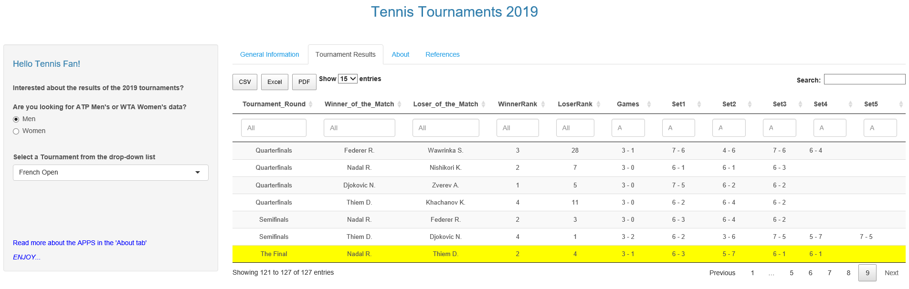
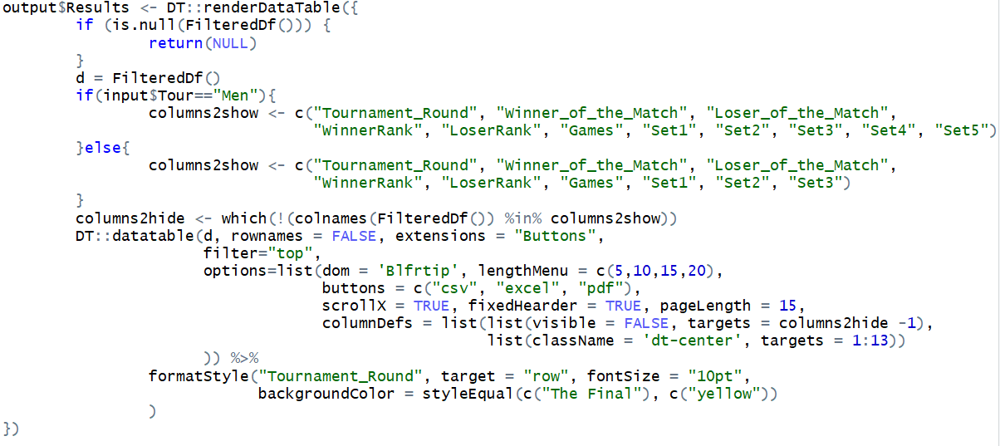

TENNIS TOURNAMENTS RESULTS FROM 2019 
========================================================
type: titlepage
author: Myriam Ragni
date: 21 February 2020
autosize: true
transition: rotate
font-family: 'Verdana'

INTRODUCTION
========================================================
<style>
/* slide titles */
.reveal h3 { 
  font-size: 50px;
  color: blue;
}
.reveal p { 
  font-size: 28px;
  color: black;
}
.reveal ul { 
  font-size: 26px;
  color: grey;
}
.small-code pre code { 
  font-size: 12px;
}
</style>
The purpose of this assignment was to create a Shiny application and to produce a pitch presentation. 
<br><br>
My Shiny application presents a table view of the tennis match results per Men/Women tournament which took place in 2019.
- The Shiny application code is available here: [http://github.com/RAGNIMY1/DevelopingDataProducts ](http://github.com/RAGNIMY1/DevelopingDataProducts)
- The application is hosted here:  [http://myriamragni.shinyapps.io/tennistournaments/](http://myriamragni.shinyapps.io/tennistournaments/)
- Guidance to the usage of the application can be found in the 'About' tab of the application.


DATA SOURCE
========================================================
class: small-code
Data has been extracted from [http://www.tennis-data.co.uk/alldata.php](http://www.tennis-data.co.uk/alldata.php).  <br>My Shiny application is based on the ATP Men's and WTA Women's Tour data for the 2019 season.     
<u><i>Extract of the Men data set for the 'French Open' Tournament:</u></i> 


```r
dfMen <- read.xlsx("./TennisTournamentsMen2019.xlsx",sheet = 1, colNames=TRUE)
dfMenExtract <- dfMen %>% 
        select(Tournament, Round, Winner, Loser, W1, L1, W2, L2, W3, L3) %>% 
        filter(Tournament=="French Open",Round=="Quarterfinals"|Round=="Semifinals") 
kable(x=dfMenExtract,booktabs=T,align='ccc') %>% kable_styling(font_size = 14)
```

<table class="table" style="font-size: 14px; margin-left: auto; margin-right: auto;">
 <thead>
  <tr>
   <th style="text-align:center;"> Tournament </th>
   <th style="text-align:center;"> Round </th>
   <th style="text-align:center;"> Winner </th>
   <th style="text-align:center;"> Loser </th>
   <th style="text-align:center;"> W1 </th>
   <th style="text-align:center;"> L1 </th>
   <th style="text-align:center;"> W2 </th>
   <th style="text-align:center;"> L2 </th>
   <th style="text-align:center;"> W3 </th>
   <th style="text-align:center;"> L3 </th>
  </tr>
 </thead>
<tbody>
  <tr>
   <td style="text-align:center;"> French Open </td>
   <td style="text-align:center;"> Quarterfinals </td>
   <td style="text-align:center;"> Federer R. </td>
   <td style="text-align:center;"> Wawrinka S. </td>
   <td style="text-align:center;"> 7 </td>
   <td style="text-align:center;"> 6 </td>
   <td style="text-align:center;"> 4 </td>
   <td style="text-align:center;"> 6 </td>
   <td style="text-align:center;"> 7 </td>
   <td style="text-align:center;"> 6 </td>
  </tr>
  <tr>
   <td style="text-align:center;"> French Open </td>
   <td style="text-align:center;"> Quarterfinals </td>
   <td style="text-align:center;"> Nadal R. </td>
   <td style="text-align:center;"> Nishikori K. </td>
   <td style="text-align:center;"> 6 </td>
   <td style="text-align:center;"> 1 </td>
   <td style="text-align:center;"> 6 </td>
   <td style="text-align:center;"> 1 </td>
   <td style="text-align:center;"> 6 </td>
   <td style="text-align:center;"> 3 </td>
  </tr>
  <tr>
   <td style="text-align:center;"> French Open </td>
   <td style="text-align:center;"> Quarterfinals </td>
   <td style="text-align:center;"> Djokovic N. </td>
   <td style="text-align:center;"> Zverev A. </td>
   <td style="text-align:center;"> 7 </td>
   <td style="text-align:center;"> 5 </td>
   <td style="text-align:center;"> 6 </td>
   <td style="text-align:center;"> 2 </td>
   <td style="text-align:center;"> 6 </td>
   <td style="text-align:center;"> 2 </td>
  </tr>
  <tr>
   <td style="text-align:center;"> French Open </td>
   <td style="text-align:center;"> Quarterfinals </td>
   <td style="text-align:center;"> Thiem D. </td>
   <td style="text-align:center;"> Khachanov K. </td>
   <td style="text-align:center;"> 6 </td>
   <td style="text-align:center;"> 2 </td>
   <td style="text-align:center;"> 6 </td>
   <td style="text-align:center;"> 4 </td>
   <td style="text-align:center;"> 6 </td>
   <td style="text-align:center;"> 2 </td>
  </tr>
  <tr>
   <td style="text-align:center;"> French Open </td>
   <td style="text-align:center;"> Semifinals </td>
   <td style="text-align:center;"> Nadal R. </td>
   <td style="text-align:center;"> Federer R. </td>
   <td style="text-align:center;"> 6 </td>
   <td style="text-align:center;"> 3 </td>
   <td style="text-align:center;"> 6 </td>
   <td style="text-align:center;"> 4 </td>
   <td style="text-align:center;"> 6 </td>
   <td style="text-align:center;"> 2 </td>
  </tr>
  <tr>
   <td style="text-align:center;"> French Open </td>
   <td style="text-align:center;"> Semifinals </td>
   <td style="text-align:center;"> Thiem D. </td>
   <td style="text-align:center;"> Djokovic N. </td>
   <td style="text-align:center;"> 6 </td>
   <td style="text-align:center;"> 2 </td>
   <td style="text-align:center;"> 3 </td>
   <td style="text-align:center;"> 6 </td>
   <td style="text-align:center;"> 7 </td>
   <td style="text-align:center;"> 5 </td>
  </tr>
</tbody>
</table>

SHINY APPLICATION
========================================================
The Main Panel is subdivided into 4 tabs:
<ul><il><b>General Information: </b> gives information to the serie/tier of the tournament, the location and the court surface<br>
<il><b>Tournament Results: </b> provides a table with the match results for the selected tournament (screenshot below)<br>
<il><b>About: </b> provides a description of the application<br>
<il><b>References: </b> contains the link to the source code.
</ul>



CODE EXTRACT server.R
========================================================
The following is an excerpt of the server logic.<br>
It shows the function used to generate a HTML table view of the tournament's results. <br>

